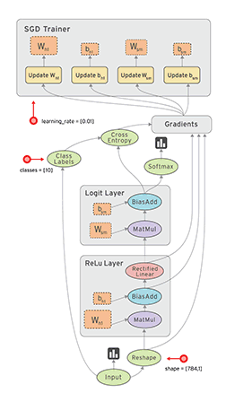

# TensorFlow

这是我关于TensorFlow 的学习手册，主要内容将参考TensorFlow中文网里面的内容。

## 学习目标

1. 学会使用tf构建深度学习模型
2. 掌握tensorboard可视化技术
3. 深入理解TensorFlow思维


## TensorFlow是什么？

自谷歌的AlphaGo击败围棋职业围棋选手后，人工智能迎来了第三次浪潮。作为时代的弄潮儿，我也赶上了这波巨浪。在这次的浪潮中，深度学习，一个披上了光鲜外衣的神经网络模型，自众多智能算法中脱颖而出。随着程序门槛的降低，机器学习走进了越来越多人的视野中。

我是幸运的，接触到了Python这门诗一般的语言。其中，和机器学习相关的Model有很多，基础的如Numpy、Pandas等，高度封装的有Scikit-Learn、Keras等，而TensorFlow、PyTorch、Caffe等作为略偏底层的深度学习模块，提供了更灵活的操作。我曾在网上搜索过TensorFlow和PyTorch的优劣势，结论也比较统一：

> TensorFlow是一个非常强大非常成熟的深度学习库，具有非常强大的可视化功能，以及有多个可供选择的框架来进行高级模型开发。它具有用于生产的部署选项，以及对移动平台的支持。这是一个**企业级**的模型框架。PyTorch是一个**年轻**的框架，但其发展速度越来越快，它更适合作为科研工作的相关模型框架。

在初步了解了TensorFlow和PyTorch之后，我被TensorBoard所吸引。这是我最终选择TensorFlow的主要原因之一。那么，TensorFlow到底是什么？在其中文社区里有如下描述：

```
TensorFlow™ 是一个采用数据流图（data flow graphs），用于数值计算的开源软件库。节点（Nodes）在图中表示数学操作，图中的线（edges）则表示在节点间相互联系的多维数据数组，即张量（tensor）。它灵活的架构让你可以在多种平台上展开计算，例如台式计算机中的一个或多个CPU（或GPU），服务器，移动设备等等。TensorFlow 最初由Google大脑小组（隶属于Google机器智能研究机构）的研究员和工程师们开发出来，用于机器学习和深度神经网络方面的研究，但这个系统的通用性使其也可广泛用于其他计算领域。
数据流图用“结点”（nodes）和“线”(edges)的有向图来描述数学计算。“节点” 一般用来表示施加的数学操作，但也可以表示数据输入（feed in）的起点/输出（push out）的终点，或者是读取/写入持久变量（persistent variable）的终点。“线”表示“节点”之间的输入/输出关系。这些数据“线”可以输运“size可动态调整”的多维数据数组，即“张量”（tensor）。张量从图中流过的直观图像是这个工具取名为“Tensorflow”的原因。一旦输入端的所有张量准备好，节点将被分配到各种计算设备完成异步并行地执行运算。
```



我无法去谈论各模块之间的优劣，但我确实被上图所惊艳到了。作为Google出品的神器，大品牌，质量有保证，值得信赖。TensorFlow也的确有着它的骄傲，在其简介中有着相关的特征介绍：

1. 高度的灵活性
2. 真正的可移植性
3. 将科研和产品联系在一起
4. 自动求微分
5. 多语言支持
6. 性能最优化

好吧，这都是网上的一些内容，暂且做个搬运工，罗列在这里吧，等有一些了解后，再来重新组织把。

----------------------------------------------------写于2018年02月08日----------------------------------------------------